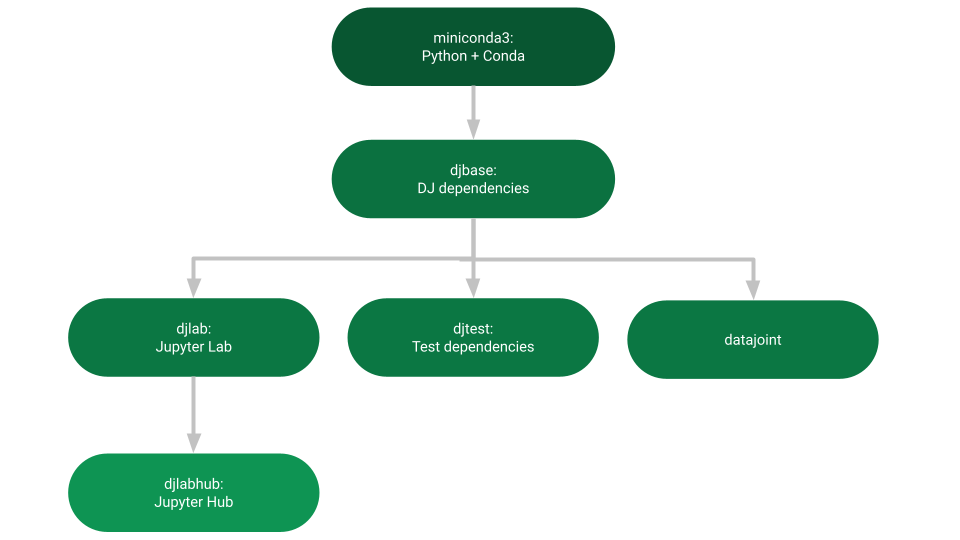

Documentation for the DataJoint's Miniconda3 Image
##################################################

| A minimal base docker image with ``conda``.
| For more details, have a look at `prebuilt images <https://hub.docker.com/r/datajoint/miniconda3>`_, `source <https://github.com/datajoint/miniconda3-docker>`_, and `documentation <https://datajoint.github.io/miniconda3-docker>`_.

.. toctree::
   :maxdepth: 2
   :caption: Contents:

Image Hierarchy
***************

Launch Locally
**************

Debian
======
.. code-block:: shell

   docker-compose -f dist/debian/docker-compose.yaml --env-file config/.env up --build

Alpine
======
.. code-block:: shell

   docker-compose -f dist/alpine/docker-compose.yaml --env-file config/.env up --build

Features
********

- Provides a minimal docker image with ``conda``, ``python``, and ``pip``.
- Adds ``conda-forge`` channel as default.
- Disables ``conda`` auto-update functionality. This prevents the image from growing large between builds. To update, invoke ``conda update`` explicitly.
- Includes ``en_US.UTF-8`` locale.
- Creates an internal system user ``anaconda``. By default, utilizes ``anaconda:anaconda`` when creating containers.
- Image avoids using ``root`` to preserve possible privilege escalation vulnerabilities on docker host. As a means to perform installs while under ``anaconda:anaconda``, you may utilize any combination of the following and trigger it via ``/entrypoint.sh [command to run once completed]`` e.g. ``/entrypoint.sh echo done``.

  - Debian dependencies: Create a ``\n`` delimited file containing the system dependencies at ``/tmp/apt_requirements.txt``. This can be created manually within container/image or mounted in.
  - Alpine dependencies: Create a ``\n`` delimited file containing the system dependencies at ``/tmp/apk_requirements.txt``. This can be created manually within container/image or mounted in.
  - Conda dependencies: Create a ``\n`` delimited file containing the conda dependencies at ``/tmp/conda_requirements.txt``. This can be created manually within container/image or mounted in.
  - Pip dependencies: Create a ``\n`` delimited file containing the pip dependencies at ``/tmp/pip_requirements.txt``. This can be created manually within container/image or mounted in.

- When mounting volumes (avoid mounting files with ``root`` permissions only!), accessing files within image via ``anaconda:anaconda`` can result in permission denied errors. To avoid this, simply add a ``user`` spec in ``docker-compose.yaml`` with the appropriate ``HOST_UID`` e.g. ``user: 1000:anaconda``. Running ``/entrypoint.sh`` will then trigger a reassociation of ``anaconda``'s UID to allow permissions to access mounted files. Note that ``entrypoint.sh`` is automatically invoked when starting containers. If you are utilizing the included reference ``docker-compose.yaml`` files, you may simply set the ``HOST_UID`` environment value when building or starting the container.
- Applies image compresssion.

Usage Notes
***********

- As long as a container user is a member of ``anaconda`` group, they should have acccess to perform ``conda`` and ``pip`` operations within the default environment i.e. ``base``.
- To properly shell into the container and activate the default environment, see the ``CMD`` specification in the ``Dockerfile``. For example:

  .. code-block:: shell

     docker exec -it debian_app_1 bash || docker exec -it alpine_app_1 sh

- When installing a ``conda`` package, make sure to pin the ``python`` version to prevent upgrade within the ``base`` environment or perform the ``conda`` install in a new ``conda`` environment.

Testing
*******

To rebuild and run tests locally, execute the following statements:

.. code-block:: shell

   set -a  # automatically export sourced variables
   . config/.env  # source config for build and tests
   docker buildx bake -f dist/${DISTRO}/docker-compose.yaml --set *.platform=${PLATFORM} --set *.context=. --load # build image
   tests/main.sh  # run tests
   set +a  # disable auto-export behavior for sourced variables

Miniconda3 Release Archive
**************************

- Miniconda3 releases are pulled from 2 mirrored targets:

  - `<https://repo.anaconda.com/miniconda>`_
  - `<https://repo.continuum.io/miniconda>`_

- Compatible ``conda`` releases obey the following regex:

  .. code-block:: regex
  
     Miniconda3-py[0-9]+_[0-9.]+-Linux-x86_64\.sh

Acknowledgements
****************

Development for this image was heavily borrowed from `<https://github.com/ContinuumIO/docker-images>`_.
